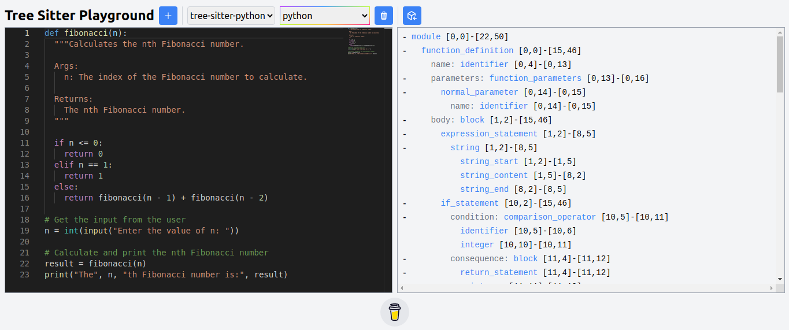

# Treeground

[](https://www.npmjs.com/package/treeground)
[](https://github.com/picomet/treeground/blob/main/LICENSE)

An interactive Tree-Sitter playground



## Features

- Hot refreshing
- Syntax highlighting
- Range folding
- Error reporting

## Requirements

- Linux / Mac
- [node](https://nodejs.org/en/download/) >= 20
- [python](https://www.python.org/downloads/) >= 3.7
- [git](https://git-scm.com/downloads)

## Setup

```bash
npx treeground
```

## Contributing

Contributions are welcome! Please see [CONTRIBUTING.md](CONTRIBUTING.md) for more details.

## License

MIT
